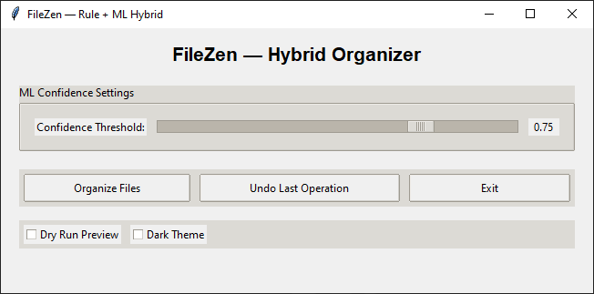
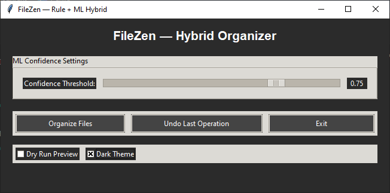
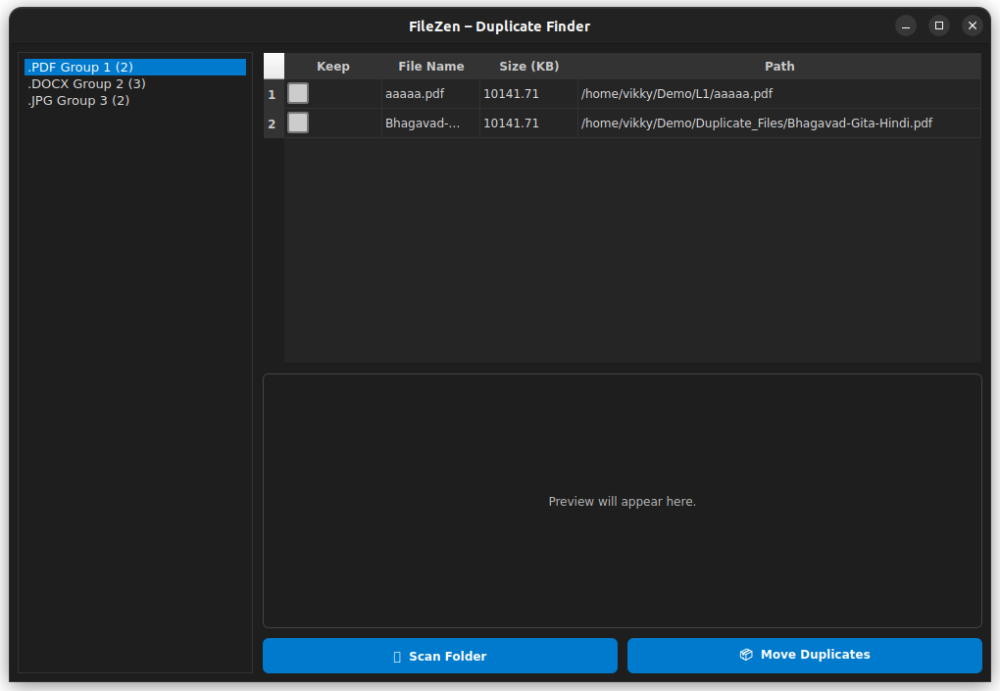

# 🧠 FileZen v2.0 — Smart File Organizer + Duplicate Finder

**FileZen v2.0** is an upgraded hybrid file management suite that combines  
💡 **AI-based organization** and 🧩 **intelligent duplicate detection** — all wrapped in a clean, modern UI.

---

## ✨ New in v2.0

- 🔍 **Smart Duplicate Finder (Integrated)**  
  Launch a dedicated duplicate-scanning window directly from FileZen.  
  - Scans files using **content hashing (SHA-256)**  
  - Groups duplicates visually  
  - Lets you **preview images** inside the app  
  - Choose which file to **keep** — others are safely moved to a `Duplicate_Files` folder  
  - Fully integrated with FileZen (auto-close + button control)

- 🧩 **Multi-Process Integration**  
  - The “Find Duplicates” button opens a separate PyQt5 window  
  - FileZen auto-disables the button while it’s running  
  - When the duplicate window closes → button re-enables automatically  
  - Closing FileZen also terminates any running duplicate window safely

- 📊 **Improved Post-Organization Report**  
  - After organizing, a popup summary shows:  
    - Number of files moved  
    - Files sent to review  
    - Operation time  

- 🌗 **Enhanced Dark/Light Theme Toggle**  
  - Smoother color transitions and persistent state  

---

## ⚙️ Core Features

### 🔹 Intelligent File Organizer
Hybrid engine that uses:
- **Rule-based sorting** (based on file extensions or config rules)
- **ML-powered predictions** for unknown or mixed files
- Files below confidence threshold → moved to **Review folder**

### 🔹 Dry Run Preview
- Preview every move before committing  
- Toggle ON/OFF easily from the main window  

### 🔹 Undo Last Operation
- Revert any file move instantly  
- Safe recovery using `undo.json`

### 🔹 Logging System
- Every organize, undo, and review action is recorded  
- Logs saved in `log.json` and `review_log.json`

### 🔹 GUI Tools
- **Tkinter-based main app** for FileZen  
- **PyQt5-based Duplicate Finder** for smoother duplicate management  

---

## 📂 Project Structure

```
filezen/
├── filezen.py                  # Main FileZen app (Tkinter)
├── filezen_duplicate_finder.py # PyQt5 duplicate finder module
├── filezen_model.pkl           # ML model (joblib)
├── config.json                 # Optional user rules
├── log.json                    # Log of operations
├── undo.json                   # Undo data
├── review_log.json             # Review tracking
├── requirements.txt            # Dependencies
└── assets/                     # Screenshots, icons, etc.
```

---

## 🖥️ GUI Snapshots

### 🪶 FileZen — Light Mode  


### 🌑 FileZen — Dark Mode  


### 🧩 Duplicate Finder Window  


---

## 🚀 Usage

### Run FileZen
```bash
python filezen.py
```

### Open Duplicate Finder
Either click **Find Duplicates** inside FileZen,  
or run standalone:
```bash
python filezen_duplicate_finder.py
```

---

## 🧠 ML Model

- Trained on categorized file datasets  
- Uses extension + metadata features for predictions  
- Adjustable **confidence threshold**  
- Low-confidence predictions automatically redirected to **Review**

---

## 🛠️ Tech Stack

| Component | Technology |
|------------|-------------|
| GUI | Tkinter + PyQt5 |
| ML | scikit-learn, joblib |
| Data Handling | pandas |
| File Preview | Pillow (Images only) |
| Hashing | imagehash, hashlib |
| Reporting | JSON-based logs |

---

## ⚡ Installation

```bash
# Clone the repo
git clone https://github.com/your-username/filezen.git
cd filezen

# Create a virtual environment
python -m venv filezen
source filezen/bin/activate   # Linux/Mac
filezen\Scripts\activate     # Windows

# Install requirements
pip install -r requirements.txt
```

> 📝 **Make sure** your `requirements.txt` includes:  
> `pandas scikit-learn joblib python-docx PyPDF2 Pillow imagehash PyQt5`

---

## 🧾 License

Licensed under the **MIT License** — free to use, modify, and share.

---

## 🛣️ Roadmap

- [ ] Log viewer tab inside GUI  
- [ ] Drag & drop support  
- [ ] Sub-category classification for media/code types  
- [ ] Minimized background mode for auto-organization  
- [ ] Cross-platform installer package  

---

👨‍💻 Developed with ❤️ by **Vikas Yadav**
